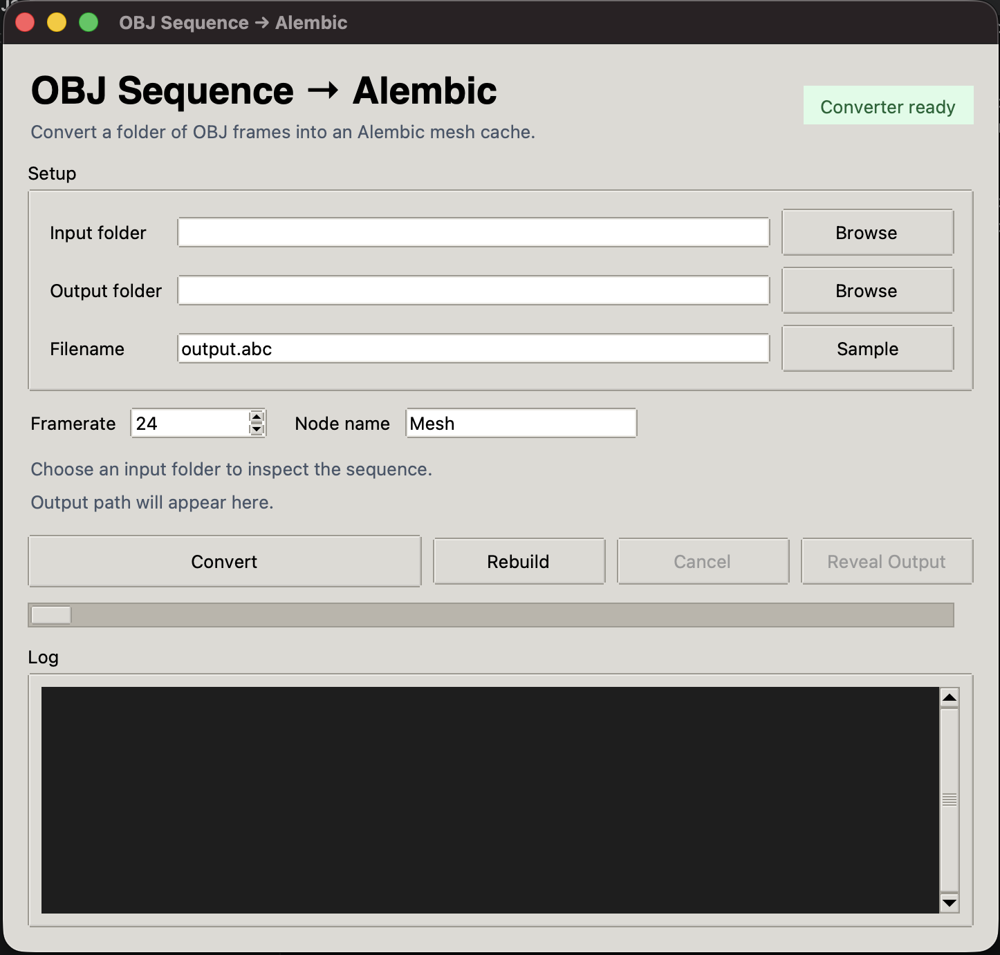

<div align="center">

# OBJ Sequence → Alembic

**Convert an OBJ frame sequence into an Alembic `.abc` mesh cache on macOS.**




</div>

---

This tool is meant for folders full of numbered OBJ files, such as:

```text
0000.obj
0001.obj
0002.obj
...
```

## Download

Download the latest `OBJ-Sequence-to-Alembic-macOS.zip` from the project's
GitHub Releases page.

After unzipping, open:

```text
OBJ Sequence to Alembic.app
```

If macOS blocks the app the first time, right-click it and choose `Open`.

## Requirements

- macOS 13 or newer
- Homebrew

The app uses Homebrew Alembic and a Homebrew Tk-enabled Python. If anything is
missing, click `Build Converter` in the app or run:

```bash
brew install cmake alembic hdf5 imath zlib python-tk
```

## How To Convert

1. Open `OBJ Sequence to Alembic.app`.
2. Choose the folder containing your OBJ sequence.
3. Choose an output folder, or leave it blank to create an `output` folder next
   to the input folder.
4. Set the output filename, framerate, and node name.
5. Click `Convert`.

The app shows the detected frame count, first and last OBJ file, first-frame
vertex/face counts, and whether UVs or normals were found.

## Input Notes

For best results:

- Put one sequence in one folder.
- Use names that sort in frame order, such as `0000.obj`, `0001.obj`,
  `0002.obj`.
- Keep topology the same across all frames.
- Keep the UV layout the same across all frames.
- Use one mesh per OBJ file.

The first OBJ frame defines the Alembic topology and UV layout. Later frames are
expected to update that same mesh's vertex positions.

## Data Support

| Data | Exported |
| --- | :---: |
| Animated vertex positions | ✅ |
| Face indices and face counts | ✅ |
| Face-varying UVs (when OBJ `vt` data exists) | ✅ |
| Framerate / time sampling | ✅ |
| Normals | ❌ |
| Materials or `.mtl` files | ❌ |
| Texture paths | ❌ |
| OBJ groups or object names | ❌ |
| Vertex colors | ❌ |
| Multiple independent meshes in one OBJ | ❌ |
| Custom attributes | ❌ |

UVs are preserved when the OBJ files contain UV data. Normals and material data
are not currently exported.

## Command Line

The app includes the same converter as a command line tool:

```bash
bin/Objs2Abc -i <input_obj_folder> -o <output_file.abc> -f <framerate>
```

Example:

```bash
bin/Objs2Abc -i head-poses -o output/head-poses.abc -f 24 -n Head
```

## Troubleshooting

If the app says the converter is missing, click `Build Converter`.

If the app bounces and closes immediately, install Homebrew's Tk-enabled Python:

```bash
brew install python-tk
```

If conversion fails because Alembic libraries are missing, run:

```bash
brew install alembic hdf5 imath zlib
```

If Homebrew itself is missing, install it from:

```text
https://brew.sh
```

## Changing Topology

Each frame is written with its own topology, so sequences whose vertex and face
counts change over time — fracture, fluid, or remeshing simulations — are
preserved correctly rather than frozen to the first frame. The output stays full
per-frame topology; control file size by exporting fewer frames or simplifying
the mesh upstream in your DCC.

## Credits

This project builds on the original
[convert_objs_to_abc](https://github.com/ziyeshanwai/convert_objs_to_abc) by
Liyou, which provides the core OBJ-to-Alembic conversion. This fork adds a macOS
app and command-line build, a Tk GUI with progress reporting, changing-topology
support, and a number of correctness and performance fixes.

## License

Released under the MIT License. See [LICENSE](LICENSE). Original work
Copyright (c) 2022 Liyou.
